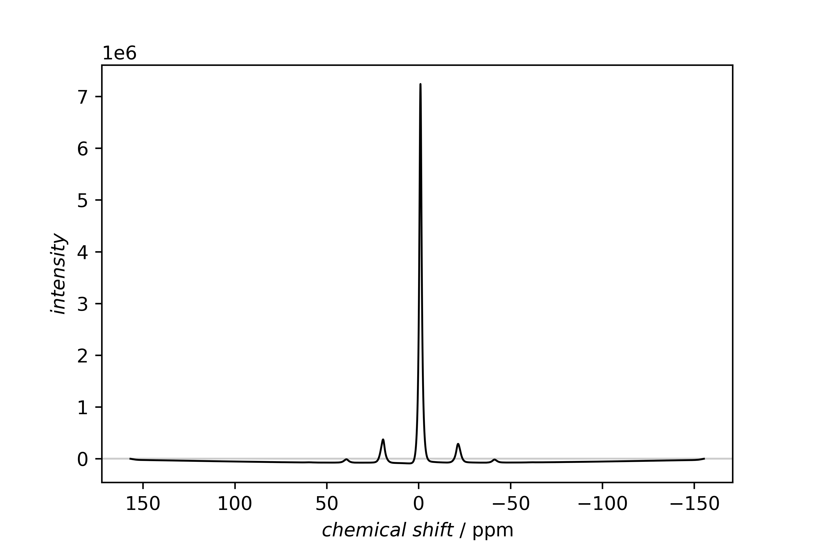
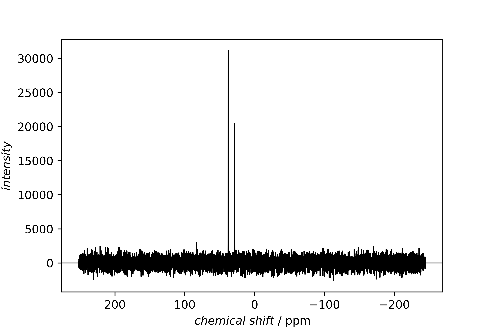

===============================
First overview of a measurement
===============================

Measuring NMR spectra of samples often results in a series of measurements, and one of the first tasks is to get an overview what has been measured and how the results look like.

Recipe
======

.. literalinclude:: plot-nmr.yaml
    :language: yaml
    :linenos:
    :caption: Complete recipe for getting an overview and compare two spectra.

Result
======

