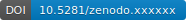

========================
NMRAspecds documentation
========================

Welcome! This is the documentation for NMRAspecds, a Python package for **reading in, manipulating and plotting NMR spectra** with the ultimate goal to document all steps and make the history of the processed spectrum **fully reproducible**. The NMRAspecds package is based on the `ASpecD framework <https://docs.aspecd.de/>`_,  hence all data generated with the NMRAspecds package are completely reproducible and have a complete history.

What is even better: Actual data processing and analysis no longer requires programming skills, but is as simple as writing a text file summarising all the steps you want to have been performed on your dataset(s) in an organised way. Curious? Have a look at the following example:

.. code-block:: yaml
    :linenos:

    format:
      type: ASpecD recipe
      version: '0.2'

    settings:
      default_package: nmraspecds

    datasets:
      - /path/to/first/dataset
      - /path/to/second/dataset

    tasks:
      - kind: processing
        type: Normalisation
        parameters:
          properties:
            kind: scan_number
      - kind: singleplot
        type: SinglePlotter1D
        properties:
          filename:
            - first_dataset.pdf
            - second_dataset.pdf

Interested in more real-live examples? Check out the growing :doc:`list of examples <examples/index>` providing complete recipes for different needs.

Features
========

A list of features:

* Fully reproducible processing and analysis of NMR data.

* Gap-less record of each processing/analysis step, including explicit and implicit parameters.

* Import of Bruker NMR data

* Generic representation of NMR data, independent of the original format.

* Datasets contain both, numerical data and all crucial metadata, a prerequisite for FAIR data.

* Generic plotting capabilities, easily extendable

* Report generation using pre-defined templates

* Recipe-driven data analysis, allowing tasks to be performed fully unattended in the background

And to make it even more convenient for users and future-proof:

* Open source project written in Python (>= 3.7)

* Developed mostly test-driven

* Extensive user and API documentation

.. note::
  NMRAspecds is currently under active development and still considered in Beta development state. Therefore, expect frequent changes in features and public APIs that may break your own code. Nevertheless, feedback as well as feature requests are highly welcome.

Requirements
============

The NMRAspecds package comes with a rather minimal set of requirements:

* Python >= 3.7 with aspecd, spindata, numpy, scipy and matplotlib packages
* command-line access for :doc:`recipe-driven data analysis <usecases>`
* NMR data in readable formats (details in the :mod:`nmraspecds.io` module)

.. _sec-how_to_cite:

How to cite
===========

NMRAspecds is free software. However, if you use NMRAspecds for your own research, please cite the software:

  * Mirjam Schröder. NMRAspecds (2024). `doi:10.5281/zenodo.xxxxxxx <https://doi.org/10.5281/zenodo.xxxxxxx>`_

To make things easier, NMRAspecds has a `DOI <https://doi.org/10.5281/zenodo.xxxxxxx>`_ provided by `Zenodo <https://zenodo.org/>`_, and you may click on the badge below to directly access the record associated with it. Note that this DOI refers to the package as such and always forwards to the most current version.

Installation
============

To install the NMRAspecds package on your computer (sensibly within a Python virtual environment), open a terminal (activate your virtual environment), and type in the following:

.. code-block:: bash

    pip install nmraspecds

Related projects
================

There is a number of related packages users of the NMRAspecds package may well be interested in, as they have a similar scope, focussing on spectroscopy and reproducible research.

* `ASpecD <https://docs.aspecd.de/>`_

  A Python framework for the analysis of spectroscopic data focussing on reproducibility and good scientific practice. The framework the NMRAspecds package is based on, developed by T. Biskup.

* `FitPy <https://docs.fitpy.de/>`_

  Framework for the advanced fitting of models to spectroscopic data focussing on reproducibility, developed by T. Biskup.

License
=======

This program is free software: you can redistribute it and/or modify it under the terms of the **BSD License**. However, if you use NMRAspecds for your own research, please cite it appropriately. See :ref:`How to cite <sec-how_to_cite>` for details.

.. toctree::
   :maxdepth: 2
   :caption: User Manual:
   :hidden:

   audience
   usecases
   concepts
   dataset-structure
   installing

.. toctree::
   :maxdepth: 2
   :caption: Developers:
   :hidden:

   people
   developers
   changelog
   roadmap
   api/index

